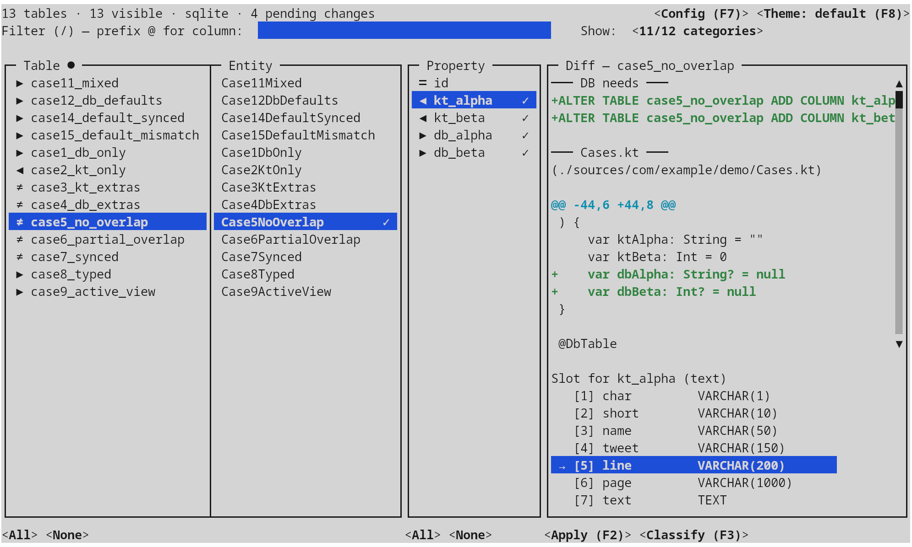

<p align="center">
  
</p>

# Stormify

<p align="center">
  <a href="https://central.sonatype.com/artifact/onl.ycode/stormify-jvm"></a>
  <a href="https://github.com/teras/stormify/blob/main/LICENSE.md"></a>
  
  
</p>

Stormify is a flexible ORM library for Kotlin Multiplatform that simplifies database interactions with minimal configuration. It operates and performs CRUD operations on plain Kotlin classes without requiring extensive annotations or XML setups, as long as field names match database columns.

Designed for developers seeking a simple yet powerful ORM, Stormify excels in projects that favor convention over configuration, allowing for minimal setup and clean, straightforward code.

<p align="center">
  <a href="https://stormify.org"></a>
  &nbsp;
  <a href="https://stormify.org/docs/2.5.1/"></a>
  &nbsp;
  <a href="https://stormify.org/docs/2.5.1/api-stormify/"></a>
</p>

## Features

- **Kotlin Multiplatform**: JVM (Java & Kotlin), Android, Linux (x64 & ARM64), Windows (x64), macOS, and iOS — same API across all platforms.
- **Native Database Access**: Direct access to PostgreSQL, MariaDB/MySQL, Oracle, MSSQL, and SQLite on Linux, Windows, and macOS without JVM or JDBC.
- **Android Support**: Full ORM on Android's built-in SQLite, with compile-time entity metadata via annotation processing.
- **iOS Support**: SQLite-based ORM on iOS devices and simulators.
- **CRUD Operations**: Easily create, read, update, and delete records, with batch variants for bulk operations.
- **Annotation-Free Classes**: Perform operations with plain Kotlin classes without the need for extensive annotations or XML files.
- **Fine or Coarse Grain Definitions**: Define naming policies and primary key resolvers for standard naming patterns, or use annotations to handle special cases.
- **JPA Compatibility**: Support common JPA annotations to maintain compatibility and simplify integration.
- **Flexible Query Execution**: Execute custom and complex SQL queries and map results to Kotlin objects, with automatic collection parameter expansion for `IN` clauses.
- **Transaction Management**: Support for nested transactions with rollback and commit capabilities via savepoints.
- **Coroutines**: Suspend-based transaction API with a built-in connection pool, coroutine cancellation wired to native database cancel primitives.
- **Enum Properties**: Enum fields stored as integers or strings, with support for custom mappings.
- **Lazy Loading**: Reference fields with `by db()` delegates for automatic lazy loading of related entities.
- **Paginated Views**: `PagedList<T>` for UI grids (ZK/Compose/Swing) and `PagedQuery<T>` for stateless REST endpoints — filters, sorting, FK traversal, aggregations, facet counts, and streaming iteration over very large result sets.
- **Stored Procedures**: Call stored procedures with input, output, and bidirectional parameters.
- **Support for Composite Keys**: Handle tables with composite primary keys effortlessly.
- **Schema Sync Tool**: Companion CLI that diffs a live database against your Kotlin entities and emits a SQL migration plus a `git apply`-ready patch — interactively as a TUI, or headless for CI hooks.

## Requirements

- **JVM**: Java 8 or later.
- **Android**: minimum API 28 (Android 9.0).
- **Native**: glibc 2.31+ on Linux, macOS 11+, iOS 14+, Windows 10+.

## Installation

**Gradle (all targets — JVM, Android, Kotlin Multiplatform):**

```kotlin
plugins {
    id("onl.ycode.stormify") version "2.5.1"
}
```

**Maven (pure Java):**

```xml
<dependency>
    <groupId>onl.ycode</groupId>
    <artifactId>stormify-jvm</artifactId>
    <version>2.5.1</version>
</dependency>
```

Supported native databases: **PostgreSQL, MariaDB/MySQL, Oracle, MSSQL, SQLite**. On iOS, only SQLite is available.

See [Installation](https://stormify.org/docs/2.5.1/Installation/) for configuration options and native runtime libraries.

> **Upgrading from V1?** See the [V1 to V2 migration guide](https://stormify.org/docs/2.5.1/Migration_V1_to_V2/).

## Basic Usage

### Configure Your Database

Stormify works with any JDBC `DataSource`. The examples below use HikariCP, but any connection pool or plain driver will work.

**Kotlin (JVM):**

```kotlin
val config = HikariConfig("databaseConfig.properties")
val dataSource = HikariDataSource(config)
val stormify = Stormify(dataSource)
```

**Java:**

```java
HikariConfig config = new HikariConfig("databaseConfig.properties");
HikariDataSource dataSource = new HikariDataSource(config);
StormifyJ stormify = new StormifyJ(dataSource);
```

**Android:**

```kotlin
val db = context.openOrCreateDatabase("mydb.db", Context.MODE_PRIVATE, null)
val stormify = Stormify(db)
```

**Native:**

```kotlin
val ds = KdbcDataSource("jdbc:postgresql://localhost:5432/mydb", "user", "pass")
val stormify = Stormify(ds)
```

### Creating an Entity Class

Define a simple Kotlin class. The library automatically maps fields based on their names.
For a table `CREATE TABLE test (id INT PRIMARY KEY, name VARCHAR(255))`:

```kotlin
@DbTable("test")  // optional on JVM — class name is used by default
data class Test(
    @DbField(primaryKey = true)
    var id: Int = 0,
    var name: String = ""
)
```

Mark primary keys with `@DbField(primaryKey = true)`, or register a primary key resolver to detect them by naming convention.

### Performing CRUD Operations

```kotlin
// Create
val record = stormify.create(Test(id = 1, name = "Test Entry"))

// Read
val results = stormify.read<Test>("SELECT * FROM test")

// Update
record.name = "Updated Entry"
stormify.update(record)

// Delete
stormify.delete(record)
```

### Using Transactions

**Kotlin:**

```kotlin
stormify.transaction {
    val user = stormify.create(User(email = "test@example.com"))
    stormify.create(Profile(userId = user.id, name = "Test User"))
    stormify.update(account)
}
```

**Java:**

```java
stormify.transaction(() -> {
    User user = stormify.create(new User("test@example.com"));
    stormify.create(new Profile(user.getId(), "Test User"));
    stormify.update(account);
});
```

### Advanced Queries

```kotlin
// Query with parameters
val users = stormify.read<User>("SELECT * FROM users WHERE age > ?", 25)

// Single result
val user = stormify.readOne<User>("SELECT * FROM users WHERE id = ?", 1)

// Find by ID
val user = stormify.findById<User>(1)
```

## Examples

Runnable example projects live in a separate repository: [stormify-examples](https://github.com/teras/stormify-examples/tree/2.5.1). They cover JVM (Kotlin & Java — both [Maven](https://github.com/teras/stormify-examples/tree/2.5.1/java-pom) and [Gradle with type-safe paths](https://github.com/teras/stormify-examples/tree/2.5.1/java-gradle)), Android, iOS, Kotlin/Native (Linux, Windows, macOS), and Kotlin Multiplatform.

Clone them standalone:

```bash
git clone -b 2.5.1 https://github.com/teras/stormify-examples.git
```

Or pull them directly inside this repo as a submodule:

```bash
git submodule update --init --recursive
```

Each subfolder is a self-contained project with its own `README.md` explaining how to build and run it. See the [Examples overview](https://stormify.org/docs/2.5.1/Examples/) for a short description of each.

## Schema Sync

Stormify ships with a companion CLI, **schema-sync**, that reconciles a live
database with the Kotlin entity sources in your project. Point it at a JDBC
URL and one or more source roots; it introspects every table and view, pairs
each with its matching entity, and stages two kinds of change:

- additive SQL migrations (`CREATE TABLE` / `ALTER TABLE … ADD`) for fields
  the entities have but the database doesn't, and
- **live in-place edits to your `.kt` entity files**, plus brand-new entity
  files for tables that don't have one yet.

In the interactive flow, those Kotlin edits aren't dumb text patches —
schema-sync embeds the full Kotlin compiler and rewrites entity classes
through PSI, so existing imports, formatting, comments, constructor style,
and `by db()` delegate conventions in the file are preserved. New properties
are spliced into the right class body with the correct supertype, naming
policy, and FK references resolved to your existing entities.

<p align="center">
  
</p>

The interactive TUI is a four-pane workspace — tables, entities, properties,
and a live diff that previews exactly what will be written. An n-gram
classifier trained on your already-synced columns suggests the right type
slot for new fields; per-category slots, per-dialect defaults, naming policy,
and Kotlin-side preferences all live in `.schema-sync.toml` and travel with
the repo. A bulk-classify view assigns slots across hundreds of columns at
once; a tabbed apply view shows the patched source of every affected entity
file alongside the migration SQL before anything hits disk; a configuration
window edits everything in the TOML without leaving the tool. Themes,
keyboard-only navigation, and a built-in help dialog round it off.

A headless mode also exists for pre-commit hooks and CI gates — same engine,
same output, but the Kotlin edits land as a `git apply`-ready patch instead
of touching files directly, so CI can fail cleanly when the schema drifts.

See the [Schema Sync guide](https://stormify.org/docs/2.5.1/Schema_Sync/) for
the full feature tour, configuration reference, and per-dialect notes.

## How Stormify stacks up

A quick side-by-side against common Kotlin and Java ORMs. See the [full comparison](https://stormify.org/docs/2.5.1/Comparison/) for reflection behaviour, compile-time metadata, narrative context, and when to pick each.

|  | Stormify | Exposed | Ktorm | Komapper | SQLDelight | Hibernate |
|---|---|---|---|---|---|---|
| Multiplatform · JVM + Android + native + iOS | ✓ | JVM + Android | JVM | JVM | ✓ | JVM |
| Native DB drivers · no JDBC required | ✓ | — | — | — | SQLite only | — |
| Facet-aware paged queries, built-in | ✓ | — | — | — | — | — |
| Any class as entity | ✓ | — | — | — | — | — |
| Accepts JPA annotations | ✓ | — | — | — | — | ✓ |
| Suspend / coroutines API | ✓ | ✓ | — | ✓ | ✓ | — |
| Lazy reference delegates | ✓ | DAO only | eager only | — | — | ✓ |
| Stored procedures (in/out/inout) | ✓ | manual | manual | — | — | ✓ |

## Documentation

Full documentation is available at [stormify.org/docs](https://stormify.org/docs/2.5.1/).

## Contributing

Contributions are welcome! Please check the [Contributing](https://stormify.org/docs/2.5.1/Contributing/) guide for instructions on how to get involved, report issues, or submit pull requests.

## License

Stormify is licensed under the [Apache License 2.0](https://www.apache.org/licenses/LICENSE-2.0). You are free to use, modify, and distribute this library in accordance with the terms of the license.

---

Enjoy using Stormify? Please star this repository to show your support!
