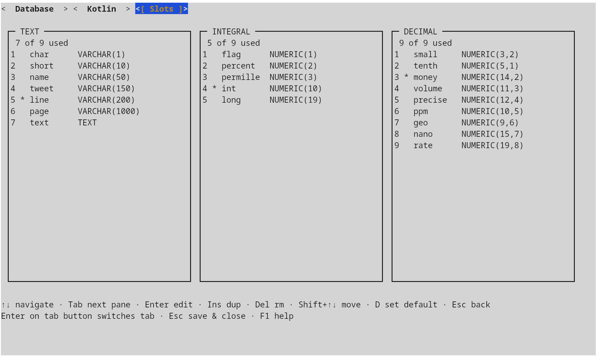
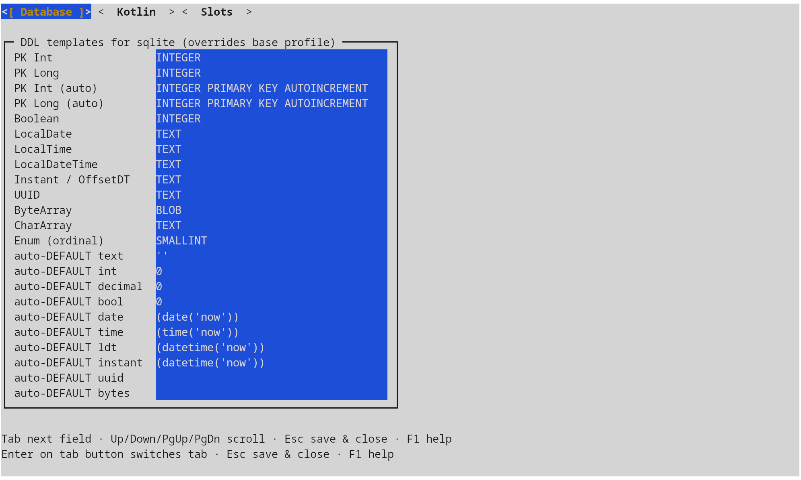
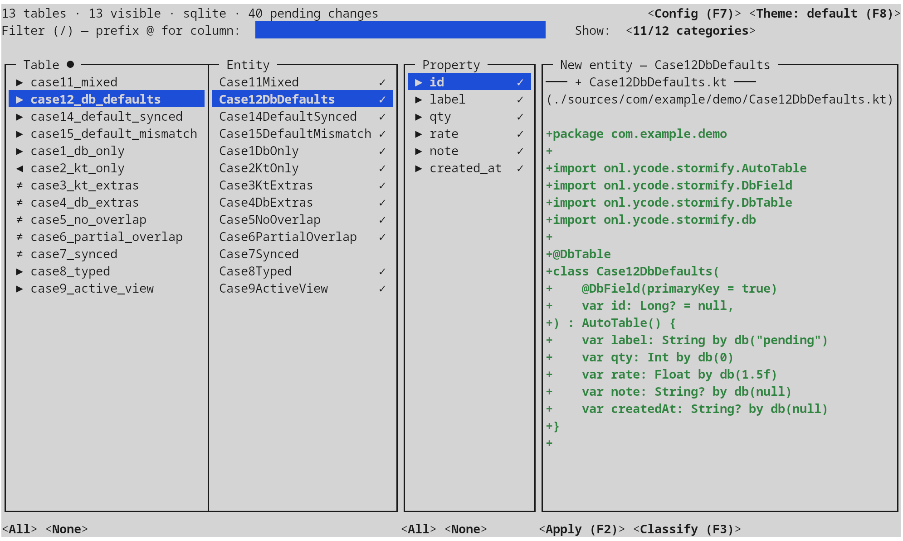
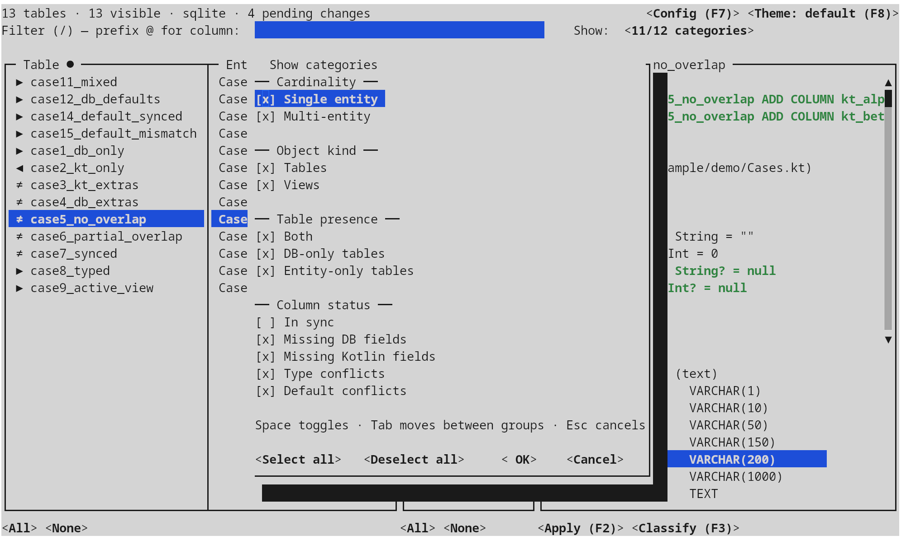
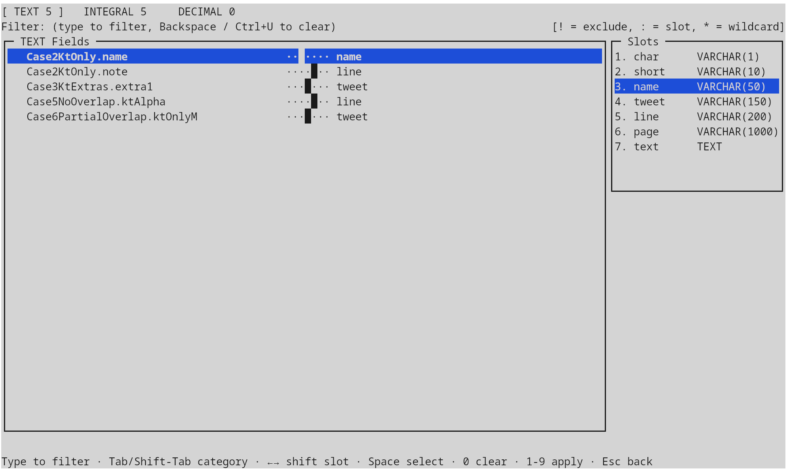

# Schema Sync

`schema-sync` is a companion CLI that reconciles a live database schema with a
project's Kotlin entity sources. It stages two kinds of change, both
auditable and committable:

- additive **SQL migrations** (`CREATE TABLE` / `ALTER TABLE … ADD`) for
  fields the entities have but the database doesn't, and
- **live in-place edits to your `.kt` entity files**, plus brand-new entity
  files for tables that don't have a matching class yet.

The same engine drives two ways of consuming those changes:

- **Interactive TUI** (the default) — a full-screen workspace that runs
  natively in any modern terminal (Linux, macOS, Windows) and walks tables
  and columns one slot at a time. The Kotlin
  side is **not** a text patch: `schema-sync` embeds the full Kotlin compiler
  (`kotlin-compiler-embeddable`) and rewrites entity classes through PSI, so
  existing imports, formatting, comments, constructor style, and `by db()`
  delegate conventions in the file are preserved. New properties are spliced
  into the right class body with the correct supertype, the project's
  naming policy, and FK references resolved against your existing entities.
- **Headless mode** (activated by any `--export-*` flag) — runs the same
  introspection and diff and exits without ever drawing the TUI. The
  migration is written exactly as in the interactive flow; the Kotlin edits
  land as a `git apply`-ready unified-diff patch instead of being applied to
  the source files directly. Intended for pre-commit hooks, CI gates, and
  one-shot regenerations where a human review step is mandatory.

## Overview

Given a JDBC URL and one or more Kotlin source roots, `schema-sync`:

1. introspects every table and view, collecting columns, types, nullability,
   defaults, and primary-key membership;
2. parses the Kotlin sources with the embeddable Kotlin compiler (PSI), picking
   up classes annotated with `@DbTable`, `@Table`, `@Entity`, or carrying any
   `@DbField` / `@Id` property;
3. pairs each entity with its DB table by lower-cased last-segment of the
   table key (schema is treated as opaque qualification), and computes a
   per-column delta: `SYNCED`, `DIFF` (type / default / nullability), `DB_ONLY`,
   or `ENTITY_ONLY`;
4. trains a per-category n-gram classifier on the columns that are already
   `SYNCED` — so the slot suggestions for new columns reflect *your* naming
   conventions, not a hardcoded dictionary;
5. emits the SQL/Kotlin artefacts you ask for.


## Slots, defaults, and the classifier

The reason `schema-sync` produces consistent DDL for `String`, `Int`, and
`BigDecimal` properties is that it doesn't pick types ad-hoc. Two profile
sections in `.schema-sync.toml` drive everything.

### Slots

A **slot** is a named DDL template inside one of three categories — `TEXT`,
`INTEGRAL`, `DECIMAL`. A category can hold up to nine slots; exactly one in
each is marked `default = true` and is used as the fallback when the
classifier has no signal for a column name.

```toml
[[slots.text]]
name = "name"
length = 50

[[slots.text]]
name = "line"
length = 200
default = true

[[slots.integral]]
name = "int"
digits = 10
default = true
```

Slots are edited interactively from the configuration window
([Configuration window](#configuration-window)) — three panes, one per category;
the `*` next to a row marks the current default.



### Defaults

The **defaults profile** maps deterministic Kotlin types (`Boolean`,
`LocalDate`, `Instant`, `UUID`, `ByteArray`, primary-key flavours, …) to per-
dialect DDL strings. The shipped defaults cover SQLite, PostgreSQL, MySQL,
MariaDB, Oracle, and MSSQL; project-local overrides land in the same TOML
under the matching `[defaults.<dialect>]` table.

A second group, `autoDefault*`, controls the SQL `DEFAULT` literal used when a
NOT NULL column lacks an entity initializer; setting one to an empty string
disables auto-defaulting and the migration drops a `TODO` instead.



### Classifier

For any column whose Kotlin type maps to a slot category, the classifier
suggests the best slot. It is **trained at startup** from the project's own
already-synced columns: each `(category, slot, columnName)` triple becomes a
Lucene document indexed with character n-grams (3–5), lower-cased and ASCII-
folded. The pipeline is language-agnostic — `customer`, `kunde`, and `pelatis`
look the same to the index, so multi-language schemas converge instead of
fighting the tool.

When the classifier has no signal — a brand-new column whose name doesn't
resemble any existing one — `schema-sync` falls back to the slot marked
`default = true` for that category. There is always a deterministic answer.
Bulk classification across hundreds of columns at once is covered in
[Bulk classification](#bulk-classification) below.

## TUI workflow

The main window is a four-pane layout: **tables**, **entities**, **properties**,
**diff preview**. Selection in the table pane drives entities; selection of an
entity drives the property pane; selection of a property drives the diff and
the slot picker beneath it. The header shows running totals (tables, columns,
pending changes), the current category filter, and the active theme; the
footer rotates through the contextual key bindings.



### Navigation

| Key | Action |
|---|---|
| `↑` `↓` | Navigate within the current pane |
| `←` `→` | Switch panes (tables / properties / diff) |
| `Tab` | Move focus across panes |
| `/` | Free-form filter (table / entity / column name) |
| `1`–`9` | In the diff pane: pick the slot for the current entity-only column |
| `Space` | In the properties pane: cycle the action for the current row (insert / delete / none) |
| `Delete` | Clear the action on the current row |
| `F1` / `?` | Help with the full keymap |
| `F2` | **Apply** — see below |
| `F3` | **Bulk classify** entity-only fields by category, with a name filter and a 1–9 slot picker |
| `F7` | **Configuration** — slots and per-dialect defaults (see [Slots, defaults, and the classifier](#slots-defaults-and-the-classifier)) |
| `F8` | Cycle the colour theme (Shift-F8 backwards) |
| `Esc` / `q` | Quit (or back out of a sub-window) |

### Filtering

Three independent filters narrow what shows up in the property pane and what
eventually reaches the migration / patch writers. The same three exist in
both the TUI (interactive controls) and headless mode (CLI flags).

#### Category filter — *Show categories*

Opened from the `Show:` button at the top right of the main window. Four
mutually independent groups; a row passes when **every** group with at least
one checked option contributes at least one match (AND across groups, OR
within a group).



| Group | Options (token) | What it asks |
|---|---|---|
| **Object kind** | `tables`, `views` | Restrict by what the introspector reports — physical tables vs. SQL views. Untick `views` to keep the work focused on writable tables only. |
| **Cardinality** | `single`, `multi` | One Kotlin class per table is the common case; `multi` flags slots claimed by more than one entity (multi-view, refactor leftovers, synonym aliases). Pick `multi` alone to audit those in isolation. |
| **Table presence** | `both`, `db-only`, `entity-only` | Where the slot exists. `both` = the table exists in both DB and entities (and so columns may differ). `db-only` = a table without a Kotlin class — the candidates for `CREATE TABLE`-by-introspection elsewhere, but here meaning *needs an entity scaffold*. `entity-only` = an entity whose table doesn't exist yet — the candidates for `CREATE TABLE` migrations. The three are mutually exclusive and exhaustive. |
| **Column status** | `in-sync`, `missing-db`, `missing-kt`, `type-conflicts`, `default-conflicts` | Only meaningful for `both`-presence rows. `in-sync` = column matches; `missing-db` = column is on the entity but not the table (→ `ALTER TABLE … ADD`); `missing-kt` = column is in the DB but not the entity (→ new property splice); `type-conflicts` = same column name, incompatible types; `default-conflicts` = same column, different `DEFAULT` literal. The four DIFF subdivisions can overlap and you tick whichever union you want to attack. |

Default selection: every option in every group **except `in-sync`** — the
view you want when you open the tool to fix something. Examples:

- *I want to add new columns the entities have but the DB doesn't*: tick
  `tables` only, `both` only, `missing-db` only.
- *I want to discover DB columns my entities are silently ignoring*: tick
  `tables`, `both`, `missing-kt`.
- *I want a clean read-only audit of multi-claim slots*: tick `tables` +
  `views`, `multi`, leave column-status untouched (the AND vacuously
  passes for non-DIFF rows).

In headless mode the same selection is one flag:

```bash
--categories tables,both,missing-db
--categories all          # every token, including in-sync
# (omit the flag)         # default = every token except in-sync
```

#### Free-form text filter — `/`

Live substring match driven by the filter box at the top of the main window
(focus it with `/`, or just start typing on a non-input pane). Default scope:
the **table key** and the **entity class name**. Prefix the query with `@`
to switch to **column-name** matching across every column delta in the slot
(the `@` was chosen because it doesn't clash with the bulk-classify filter
syntax — `!`, `:`, `*`).

Examples — assuming `case5_no_overlap` exists with a `kt_alpha` column:

| Type | Matches |
|---|---|
| `case5` | the `case5_no_overlap` table row (table-name match) |
| `Overlap` | every `case*Overlap*` table (entity-name match, case-insensitive) |
| `@kt_alpha` | every slot that has a `kt_alpha` column |
| `@id` | every slot with any column whose name contains `id` |

In headless mode the equivalents are two globs that AND with the category
filter and OR within themselves:

| Flag | Matches | Repeatable |
|---|---|:-:|
| `--filter-entity <glob>` | Table key or class name | ✓ |
| `--filter-property <glob>` | Column name | ✓ |

Glob syntax: `*` (any chars), `?` (one char), `[set]`; case-insensitive.
`--filter-entity 'case*Overlap*' --filter-property '!kt_*'` is *not* valid
(no negation in CLI globs) — express exclusions via the category filter or
narrow the entity glob instead.

#### Bulk-classify filter

The bulk-classify view has its **own** text-filter, narrowing just the
column list of the active category. It supports negation (`!`), slot-name
matching (`:`), and wildcards (`*`); see
[Bulk classification](#bulk-classification) for the full grammar. There is no
CLI counterpart for this filter — bulk classification is interactive only.

### Bulk classification

The bulk-classify view (opened with `F3`) groups every classifiable column by category (TEXT,
INTEGRAL, DECIMAL), shows the slot panel pinned to the right, and lets a
single keystroke apply a slot to a whole filtered group. Filter syntax: a
plain prefix narrows by name, `!` excludes, `:` switches focus to the slots
pane, `*` is wildcard, digits 1–9 apply that slot to every visible row, `0`
clears the assignment.



### Configuration window

Opened with `F7`, a tabbed editor combining everything that is normally hand-edited in
`.schema-sync.toml`:

- **Slots** — the three category panes from
  [Slots, defaults, and the classifier](#slots-defaults-and-the-classifier),
  with `Ins` to duplicate, `Del` to remove, `Shift+↑↓` to reorder, `D` to
  flip the per-category default, and `Enter` to edit.
- **Database** — per-dialect DDL templates (`Boolean`, temporal types, blob
  / clob, UUID, primary-key flavours) and the matching `auto-DEFAULT`
  literals used when a NOT NULL column lacks an entity initializer.
- **Kotlin** — naming policy (`LOWER_CASE_WITH_UNDERSCORES`,
  `UPPER_CASE_WITH_UNDERSCORES`, `CAMEL_CASE`), preferred Kotlin types for
  each category, and whether to retrofit `AutoTable()` on existing entities.

`Esc` saves and closes, so the file on disk always matches what was on
screen. A help sheet is one `F1` away in every sub-window.

### Applying changes

When the staged actions are ready, `F2` opens a tabbed full-screen
confirmation:

- **Entities** tab — the patched source of every affected `.kt` file plus the
  contents of every brand-new entity file, side-by-side with the original
  via the same renderer the in-pane diff uses, so what you see is byte-
  identical to what will be written. An editable `Entities dir:` field at
  the top sets where new entity files land; the value is persisted to
  `.schema-sync.toml`.
- **SQL** tab — the full `migration.sql` text, with an editable path field
  (also persisted) for the destination file.

Confirming writes both: the migration file is created at the chosen path, and
**existing entity files are rewritten in place through PSI** — comments,
whitespace, member ordering, and unrelated declarations are left alone; only
the targeted edits (new properties, new imports, optional `AutoTable()`
supertype) are applied. New entity files are created next to the most common
existing entity location, with the right package, supertype, and naming-
policy-correct property names.

After a successful apply the tool re-introspects automatically, so you can
chain a second pass without restarting.

## Headless / CI mode

Pass any `--export-*` flag and the TUI never starts. The same engine runs the
introspection and diff, then writes the requested artefacts and exits. Stderr
streams progress, stdout is reserved for nothing — both can be piped in CI
without surprises.

```bash
schema-sync \
  --url "jdbc:postgresql://db.local:5432/app" \
  --user "$DB_USER" --password "$DB_PASS" \
  --sources src/main/kotlin --sources src/main/kotlin-gen \
  --export-sql build/migrations/$(date +%Y%m%d).sql \
  --export-kt  build/entities.patch
```

Apply the Kotlin patch with `git apply build/entities.patch`. The patch uses
`a/` + `b/` prefixes and `/dev/null` for new files, so it round-trips through
`git apply` without `-p0`.

### Filters

Three flag families gate which rows reach the writers:

| Flag | What it filters | Repeatable |
|---|---|:-:|
| `--categories <list>` | Comma-separated tokens — see below; or `all` | — |
| `--filter-entity <glob>` | Matches `tableKey` or class name (case-insensitive) | ✓ |
| `--filter-property <glob>` | Matches column name (case-insensitive) | ✓ |

Glob syntax supports `*`, `?`, and `[set]`. Filters compose as AND across
families and OR within a family.

Recognised category tokens (alias of the same `Show categories` popup):

```
tables, views,
in-sync, missing-db, missing-kt, type-conflicts, default-conflicts,
both, db-only, entity-only,
single, multi
```

Default = every token except `in-sync`. `--categories all` selects everything.

### Connection persistence

Connection details are written to `.schema-sync.toml` in the current directory
on first use. Subsequent runs need only the directory; `--url`, `--user`,
`--password` overwrite the stored values. A team-wide TOML committed to the
repo (with the sensitive bits replaced or read from environment variables)
gives every contributor identical slot, defaults, and classifier behaviour.

## Configuration file

The shipped `default-config.toml` is the seed. On first launch it is copied
verbatim to `.schema-sync.toml` in the working directory; from that point on
the file is owned by the project and the tool never overwrites edits.

The file has three top-level sections:

- `namingPolicy` — how Kotlin property names map to column names. Values:
  `LOWER_CASE_WITH_UNDERSCORES` (default), `UPPER_CASE_WITH_UNDERSCORES`,
  `CAMEL_CASE`. Match what your Stormify runtime is configured for.
- `[defaults]` — the base profile, with `[defaults.<dialect>]` overrides for
  each of the six supported dialects.
- `[[slots.<category>]]` — the per-category slot tables (`text`, `integral`,
  `decimal`).

## Supported databases

Drivers bundled in the fatJar:

| Database | URL prefix |
|---|---|
| SQLite | `jdbc:sqlite:<path>` |
| PostgreSQL | `jdbc:postgresql://<host>[:<port>]/<db>` |
| MySQL | `jdbc:mysql://<host>[:<port>]/<db>` |
| MariaDB | `jdbc:mariadb://<host>[:<port>]/<db>` |
| Oracle | `jdbc:oracle:thin:@<host>:<port>:<sid>` |
| MS SQL Server | `jdbc:sqlserver://<host>[:<port>];databaseName=<db>` |

Per-dialect quirks the migration generator handles for you:

- MSSQL drops the `COLUMN` keyword in `ALTER TABLE … ADD`.
- SQLite cannot `ADD` a `NOT NULL` column without a `DEFAULT`; when no default
  can be inferred, a `TODO` line is emitted instead of broken SQL.
- SQLite / MSSQL primary-key templates that already include `PRIMARY KEY`
  aren't duplicated downstream.
- Oracle defaults bump `defaultRowPrefetch` to 1000 at startup so the data-
  dictionary scan completes in seconds rather than minutes on remote schemas.

## Running

Pre-built per-OS installers are produced by CI on every release tag and
attached to the matching GitHub Release; no JDK is required on the end-user
machine because each installer bundles a stripped `jlink` runtime image.

| Platform | Format | Notes |
|---|---|---|
| Linux x86_64 | `.AppImage` | universal, glibc 2.31+; needs FUSE on the host |
| Windows x64 | `.zip` | unsigned (run `schema-sync.exe` from the unpacked folder; SmartScreen prompts on first run) |
| macOS (Apple Silicon + Intel) | `.tar.gz` | signed and notarized `.app` bundle plus a CLI wrapper script |

Build them yourself with `gradle :schema-sync:installer` (host-OS only —
`jpackage` cannot cross-compile), or build the fully-bundled fatJar:

```bash
gradle :schema-sync:fatJar
java -jar schema-sync/build/libs/schema-sync-<version>-all.jar --help
```

The fatJar embeds every JDBC driver and runs on any JDK 11+.
